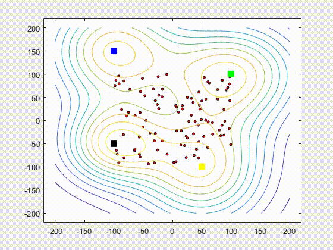

# Introduction
Scavenging is the group of animals finding the food. When flock of birds or the school of fishes scavenge, they need to go in a group and they need to make sure that each and every member gets food. By going with the flock or school, it is less attack of the predators. To be in a group, each member needs to match its own velocity with the velocity of the flock. At the same time, each member needs to avoid mutual collision within the flock. By avoiding collision and trying to match velocity, the flock scavenge the food source which is enough to supply the whole flock or the flock needs to divide sub-flocks so that each member can get food from different source.

      

