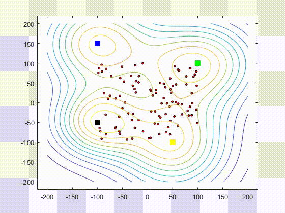
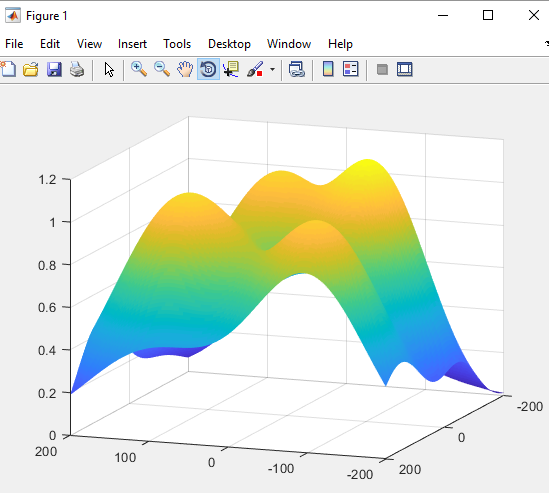
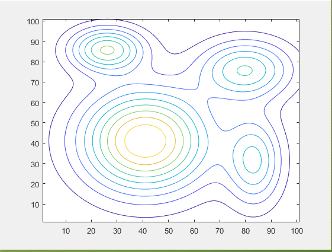

# Introduction
Scavenging is the group of animals finding the food. When flock of birds or the school of fishes scavenge, they need to go in a group and they need to make sure that each and every member gets food. By going with the flock or school, it is less attack of the predators. To be in a group, each member needs to match its own velocity with the velocity of the flock. At the same time, each member needs to avoid mutual collision within the flock. By avoiding collision and trying to match velocity, the flock scavenge the food source which is enough to supply the whole flock or the flock needs to divide sub-flocks so that each member can get food from different source.
# Demo

# Approach and Steps of the Project
## Movement of a particle
This is a simple work which only needs to make a particle moves and gets reflected back when it faces with boundaries. To implement this, we need to define initial position, initial velocity and use the simple physics equation, x = x + v*dt, where, x = position of a point,
v = velocity of a point, dt = time. Update the position of a point using looping and also define position vector to check the distance of the position of a point and the boundaries if they are too close, reflect a point.
## Movement and reflection of two particles
In this, we need two initial positions and also two initial velocities. We need to make reflection not only with the boundaries but also between two particles. To implement this, we need to define two initial positions, two initial velocities and use the same equation: 
```x1 = x1 + v1 * dt
   x2 = x2 + v2 * dt
```
Update both positions and check the reflection points and reflect. To reflect two points, we use reflection vector equation          
```
V_reflect = V+2* (V. n) *n
```
We want them to change their velocities also. So, by simplifying the equations, we got final two equations.
```v1_reflect = ((v1x2 + v1y2) / (v2x2 + v2y2)) 1/2    *  v2
   v2_reflect = ((v2x2 + v2y2) / (v1x2 + v1y2)) 1/2   *   v1
```
## Movement and reflection of multiple particles
To implement this, we use random number generator to define positions and velocities and keep them as nx2 matrix. In the iteration, we initialize them and check whether they need to reflect or not. Reflection of particles is separation factor that avoid mutual collision between particles.
## Implementing velocity matching
After few approaches to the project, here we really start our project. Velocity matching is an important concept in swarm behavior. For a particle to be in a flock or school, it needs to adjust its own with velocity its neighbor. It needs to change its velocity and direction according to its neighbor. To achieve this, first we define a region around each and every points. According to the number of particles around a certain particle, it calculates the average velocity. And change its velocity and direction.
```
Average velocity = velocities of particles around it / number of particles
```
## Implementing long range attraction
This also is important for a particle to be in a flock and not able to go away from flock. To avoid from the attack of the predator, a particle (bird-like object, boid) need to be in a group. If it goes away from the flock, the attraction from the flock must take the particle back. So, we define a central mass and also define a range that a particle can go maximum from the flock. 
## Defining the food source using gradient function
Since we want to implement the scavenging concept, we must define food sources which boids are looking for. When boids are looking for food sources they need to choose the most attractive food source or the largest food source. But if the number of boids are much more than what the food source can supply, they need to distribute. To define food source, we use gradient descent function. In our project, we define four concentrations of food sources.

### In figure 1: The peak of the function is concentration

### In figure 2: we show the concentration with contour

## Creating landscape of food source
In creating landscape of food sources, we defined four Gaussian functions and combine them with the above steps, we are successfully done our scavenging of swarms.

                  Food Sources	           Concentration
                    Yellow	                      20
                    Green	                      12
                    Blue	                       9
                    Black	                       2
# Usage
```CompleteScavenging.m``` is the main project file. Other MATLAB files are just to explain the theory and implementation steps.
# Contribute
Pull requests are welcome. For major changes, please open an issue first to discuss what you would like to change.


      

